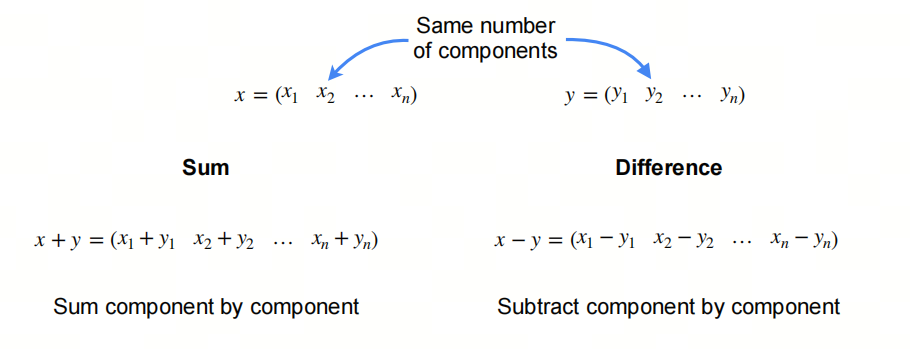
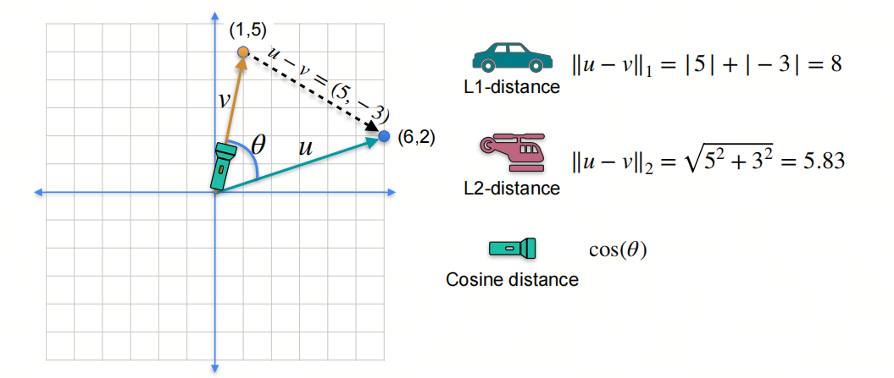
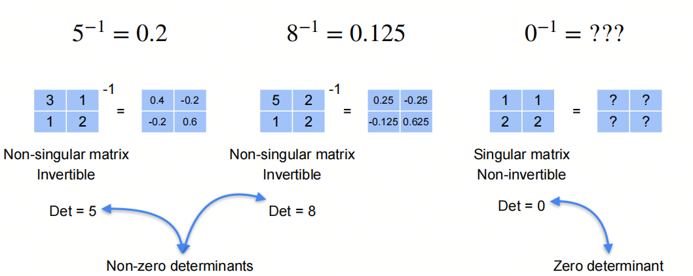

0基础学习AI大模型必备数学知识之线性代数（三）向量和线性变换

## 1. 系列介绍

AI是理科+工科的交叉学科，牢固的数学知识有助于理解算法的本质。

线性代数是AI领域的基础数学知识之一，掌握线性代数知识对于理解深度学习算法和模型至关重要。本系列将介绍AI大模型必备的线性代数知识，帮助大家更好地理解AI大模型的原理和应用。

我们会着重介绍各种基础概念，关键数学名词会加注英文以求更好的理解。我们也会分享一些大学里老师不会教的小知识，目的是帮助大家建立起对线性代数的直觉式认识。

## 2. 向量

向量是一个具有大小和方向的数学对象。它在物理学、工程学和数学中广泛应用，用于表示具有方向的量，如力、速度和位移等。向量通常用箭头表示，箭头的长度代表大小（或模），箭头的方向代表方向。

### 2.1 向量间的计算 Operations on Vectors

向量的加法是指将两个向量相加，得到一个新的向量。向量的加法满足交换律和结合律。

向量的减法是指将两个向量相减，得到一个新的向量。

### 2.2 距离 Distance

L1-norm和L2-norm是两种常见的距离计算方法：

L1-norm（机器学习中又称为曼哈顿距离）是指向量中各个元素绝对值之和；

L2-norm（机器学习中又称为欧式距离）是指向量中各个元素的平方和再开方；

余弦相似度是指两个向量之间的夹角余弦值。

### 2.3 点积 Dot Product

点积是两个向量相乘得到的标量。点积的几何意义是两个向量之间的投影。

点积有两种表示方式：$x·y$ 和 $<x,y>$

### 2.4 哈达玛积 Hadamad Product

两个向量元素相乘得到一个新向量的操作称为**哈达玛积**（Hadamard product），也称为**逐元素乘积**（element-wise product）或**Schur积**。这种操作在数学、物理学和工程学中非常常见，特别是在矩阵理论,信号处理,大模型等领域。

哈达玛积的定义如下：

给定两个维度相同的向量 $\mathbf{a} = [a_1, a_2, \ldots, a_n]$ 和 $\mathbf{b} = [b_1, b_2, \ldots, b_n]$，它们的哈达玛积是一个新向量 $\mathbf{c} = [c_1, c_2, \ldots, c_n]$，其中每个元素$c_i$ 是对应元素 $a_i$ 和 $b_i$ 的乘积，即：

$c_i = a_i \cdot b_i$

对于所有的 $i = 1, 2, \ldots, n$。

## 3. 线性变换 Linear Transformations

矩阵和向量相乘是一种线性变换，它将一个向量映射到另一个向量。矩阵和向量相乘的结果是一个新的向量。

### 3.1 秩和线性变换

假设我们有一个矩阵
$$ 
\begin{pmatrix}
3 & 1  \\
1 & 2  
\end{pmatrix}
$$

我们说它事实上是一个线性变换，因为它将一个向量映射到另一个向量。如何理解？

在我们原始的二维空间中，我们有一个向量 $\begin{pmatrix} 1 \\ 1 \end{pmatrix}$，它的坐标是 $(1,1)$。当我们将这个向量乘以矩阵时，我们得到一个新的向量 $\begin{pmatrix} 5 \\ 3 \end{pmatrix}$，它的坐标是 $(4,3)$。

同样的，对另外三个坐标点$(0,0)$，$(1,0)$，$(0,1)$，我们可以得到新的坐标点$(0,0)$，$(3,1)$，$(1,2)$。

相当于把原来的坐标（系）都进行了线性变换。

- 有的小伙伴可能会注意到，新的坐标点$(0,0)$，$(3,1)$，$(1,2)$，$(4,3)$做成的平行四边形的面积正好是矩阵的秩，这是个巧合吗？

### 3.2 单位矩阵 The identity matrix

identity 在英语中有‘身份’的意思，在数学术语中，identity也表示恒等式。 The identity matrix表示一个矩阵和向量相乘后，得到的向量和原向量相同。

单位矩阵是一个方阵，对角线上的元素都是1，其他元素都是0。单位矩阵通常用 $I$ 表示。

### 3.3 逆矩阵 Inverse

一个矩阵和它的逆矩阵相乘得到单位矩阵。

非奇异的矩阵才是可逆的，奇异矩阵是不可逆的。为什么呢？欢迎关注下一篇文章。

## 参考

[1] [machine-learning-linear-algebra](https://www.coursera.org/learn/machine-learning-linear-algebra/home/week/3)

## 欢迎关注我的GitHub和微信公众号[真-忒修斯之船]，来不及解释了，快上船！

[GitHub: LLMForEverybody](https://github.com/luhengshiwo/LLMForEverybody)

仓库上有原始的Markdown文件，完全开源，欢迎大家Star和Fork！