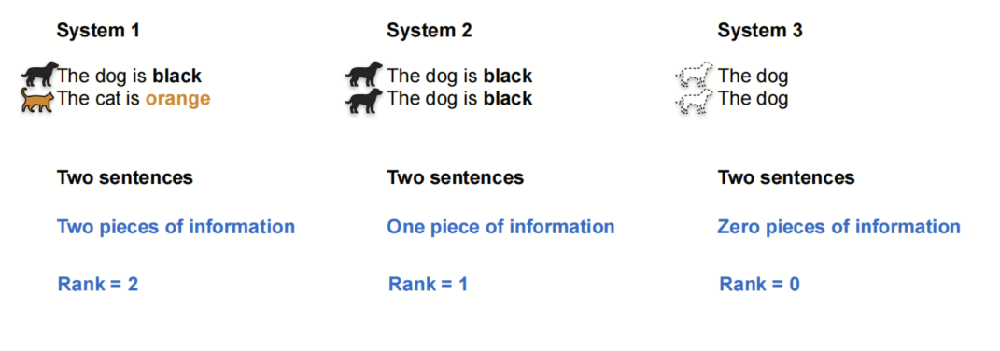
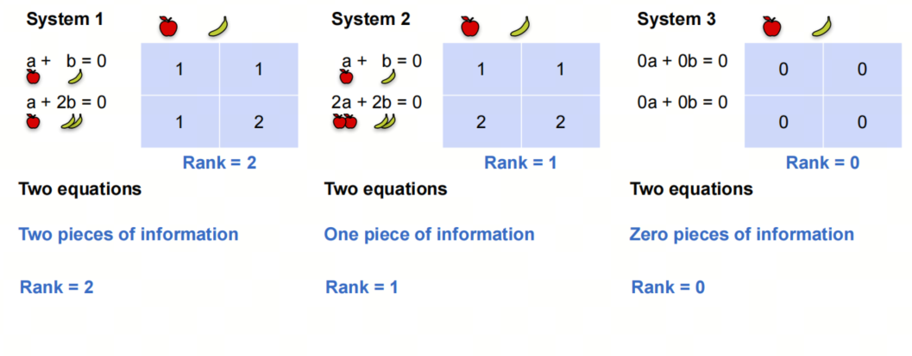
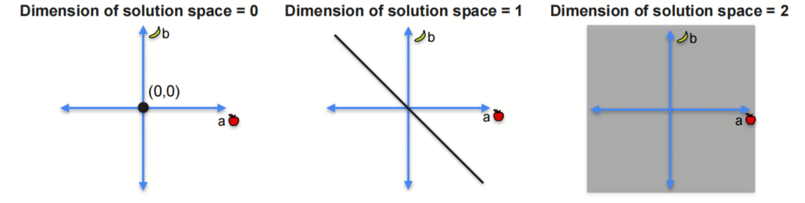
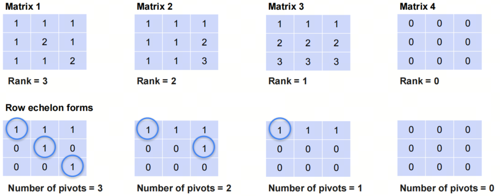
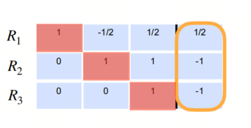

0基础学习AI大模型必备数学知识之线性代数（二）矩阵行规约，秩和行阶矩阵

## 1. 系列介绍

AI是理科+工科的交叉学科，牢固的数学知识有助于理解算法的本质。

线性代数是AI领域的基础数学知识之一，掌握线性代数知识对于理解深度学习算法和模型至关重要。本系列将介绍AI大模型必备的线性代数知识，帮助大家更好地理解AI大模型的原理和应用。

我们会着重介绍各种基础概念，关键数学名词会加注英文以求更好的理解。我们也会分享一些大学里老师不会教的小知识，目的是帮助大家建立起对线性代数的直觉式认识。


## 2. 矩阵行规约 Matrix Row Reduction

### 2.1 二元一次方程组

在学习初等代数的时候，我们会从二元一次方程组开始，逐渐引入三元一次方程组，四元一次方程组，直到n元一次方程组。


在高等代数/线性代数里，矩阵的行规约指的是在对方程组用消元法求解时，对应的系数矩阵的行变换。

### 2.2 行变换


上图中我们在解一个二元一次方程组，注意对应的系数矩阵的行变换。

这边出现了两个新术语：

1. Row echelon form 行阶梯形式（行阶梯形矩阵）
2. Reduced row echelon form 行最简梯形

- echelon是法语，意思是梯形，这个概念在数学中很常见，比如梯形数列，梯形函数等。

## 3. 秩 Rank of a Matrix

### 3.1 保持奇异性的矩阵行操作

- 如果你不清楚什么是奇异性，可以参考前文。简单来讲，奇异矩阵指的是行列式为0的矩阵。

1. 交换行
2. 乘以一个非零常数
3. 加上另一行的倍数

### 3.2 秩 Rank 

我们还是用一组句子来类比：



上图中，第一个系统包含两个句子，第二个系统包含两个重复句子，第三个系统包含两个句子，但没有任何信息量。

我们说第一个系统的rank是2，第二个系统的rank是1，第三个系统的rank是0。

## 3.3 秩和系统解的关系



对于上述的三个系统，我们可以看出，rank=2的系统有唯一解；rank=1的系统有无穷多解，但在一条线上；rank=0的系统有无穷多解，且在平面上。

如下图所示：



$$rank =2-(解空间维度) $$

## 4. 行阶（梯形）矩阵 Row Echelon Form

行阶梯形矩阵是指矩阵的第一个非零元素为1，且每一行的第一个非零元素在前一行的第一个非零元素右边。我们看几个例子：



- pivot在英文中有：枢纽，轴的意思，在线性代数的语境下，翻译成‘主元’。

### 4.1 最简行阶梯形矩阵 Reduced Row Echelon Form

最简行阶梯形矩阵是指行阶梯形矩阵的主元为1，且主元所在列的其他元素都为0。


## 5. 高斯消元法 Gauss Elimination Algorithm

高斯消元法是一种求解线性方程组的方法，它的基本思想是通过行变换将系数矩阵化为行阶梯形矩阵，然后通过回代求解。

- 该方法以数学家高斯命名，由拉布扎比.伊丁特改进，发表于法国，但最早出现于中国古籍《九章算术》，成书于约公元前150年

增广矩阵Augmented Matrix 是指将系数矩阵和常数矩阵合并在一起的矩阵。


通过高斯消元法，我们最终会得到这样的结果：



再经过回代，我们可以得到方程组的解。


下面给出高斯消元法的python代码：

```python
def gaussian_elimination(A, b):
    n = len(A)
    
    # Augment the matrix A with the vector b
    for i in range(n):
        A[i].append(b[i])
    
    # Forward elimination
    for i in range(n):
        # Find the pivot
        max_row = i
        for k in range(i+1, n):
            if abs(A[k][i]) > abs(A[max_row][i]):
                max_row = k
        # Swap the rows
        A[i], A[max_row] = A[max_row], A[i]
        
        # Make all rows below this one 0 in current column
        for k in range(i+1, n):
            c = -A[k][i] / A[i][i]
            for j in range(i, n+1):
                if i == j:
                    A[k][j] = 0
                else:
                    A[k][j] += c * A[i][j]
    
    # Back substitution
    x = [0 for _ in range(n)]
    for i in range(n-1, -1, -1):
        x[i] = A[i][n] / A[i][i]
        for k in range(i-1, -1, -1):
            A[k][n] -= A[k][i] * x[i]
    
    return x

# 示例使用
A = [
    [2, 1, -1],
    [-3, -1, 2],
    [-2, 1, 2]
]
b = [8, -11, -3]

solution = gaussian_elimination(A, b)
print("解:", solution)
```

## 参考

[1] [machine-learning-linear-algebra](https://www.coursera.org/learn/machine-learning-linear-algebra/home/week/2)

[2] [高斯消元法](https://zh.wikipedia.org/wiki/%E9%AB%98%E6%96%AF%E6%B6%88%E5%8E%BB%E6%B3%95)


## 欢迎关注我的GitHub和微信公众号[真-忒修斯之船]，来不及解释了，快上船！

[GitHub: LLMForEverybody](https://github.com/luhengshiwo/LLMForEverybody)

仓库上有原始的Markdown文件，完全开源，欢迎大家Star和Fork！