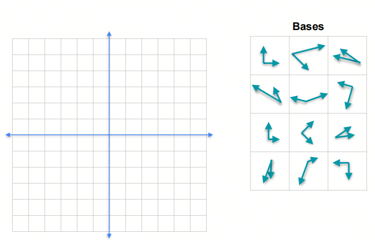
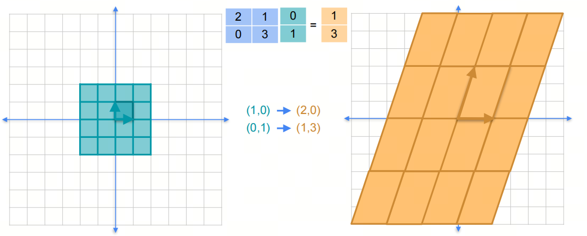
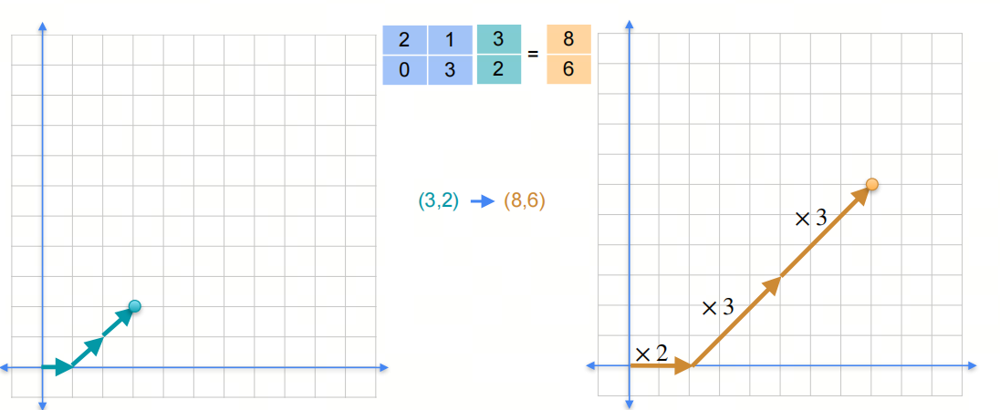

0基础学习AI大模型必备数学知识之线性代数（五）基，特征值和特征向量

## 1. 系列介绍

AI是理科+工科的交叉学科，牢固的数学知识有助于理解算法的本质。

线性代数是AI领域的基础数学知识之一，掌握线性代数知识对于理解深度学习算法和模型至关重要。本系列将介绍AI大模型必备的线性代数知识，帮助大家更好地理解AI大模型的原理和应用。

我们会着重介绍各种基础概念，关键数学名词会加注英文以求更好的理解。我们也会分享一些大学里老师不会教的小知识，目的是帮助大家建立起对线性代数的直觉式认识。

## 2. 基和张成空间 Basis and Span

- 你可能会在不同的paper里看到Basis和Bases，在英文中，Basis意思是‘基础；底部；主要成分；基本原则或原理’，在线性代数里翻译为基，basis的复数形式是bases。另外一个容易搞混的单词是base，它的复数形式是也是bases

### 2.1 基 Basis

基是一个向量空间的一组基本向量，它们可以线性组合成这个向量空间的任意向量。在二维空间中，我们可以用两个线性无关的向量来表示这个空间，这两个向量就是这个空间的基。

### 2.2 张成空间 Span

张成空间是指一个向量空间中所有可能的线性组合。在二维空间中，我们可以用两个线性无关的向量来表示这个空间，这两个向量的张成空间就是这个空间。

### 2.3 特征基 Eigenbases

特征基是我们特别需要关注的一组基，因为它有一些特殊的性质。

- eigen这个词源自德语，字面意思是“自己的”（own）。在数学和物理学中，"eigen"通常与“本征”、“固有的”或“特征的”相关联，用来描述某些属性或特征是系统或对象内在的、固有的。
20世纪初,德国大数学家希尔伯特,第一次使用eigenvalue+这个词汇来表示特征值，由于希尔伯特的巨大影响力,现在eigenvalue成了数学中最常用的词汇,比英法系的characteristic value用得更多。

对于一个矩阵（线性变换）：
$$ 
\begin{pmatrix}
3 & 1  \\
1 & 2  
\end{pmatrix}
$$

它可以把一个二维空间中的点映射到另一个二维空间中的点。我们可以看到，原始的四个坐标点$(0,0)$，$(1,0)$，$(0,1)$，$(1,1)$，经过线性变换后，得到新的坐标点$(0,0)$，$(3,1)$，$(1,2)$，$(4,3)$。

在这个二维平面上，有无数组基（向量组），但其中有一组特殊的基（向量组），作用这个矩阵后，这组基的方向不变，只是长度变了，这组基就是特征基。

***意义***：
1. 我们知道一个平面（张成空间Span）上任意的一个向量都可以由一组基线性组合而成；
2. 那么任意向量当然可以由特征基线性组成；
3. 线性变换作用在任意向量上，等于作用在特征基的线性组成上；
4. 线性变换作用在特征基上，只是**改变了特征基的长度**，方向不变；
5. 通过特征基，我们可以简化线性变换的计算。

$$ A = 
\begin{pmatrix}
2 & 1  \\
0 & 3  
\end{pmatrix}
$$

的特征基是：$(1,0),(1,1)$

$v$ = $(3,2)$

$(3,2) = 1*(1,0)+2*(1,1)$

$Av$ = $A(3,2)$ = $A*1*(1,0)+A*2*(1,1)$ = $1*A(1,0)+2*A(1,1)$ = $1*2*(1,0)+2*3*(1,1)$ = $(2,0)+(6,6)$ = $(8,6)$

## 3. 特征值和特征向量 Eigenvalues and Eigenvectors

上述的特征基和所谓**改变了特征基的长度**的度量，进一步拆解，就是特征向量和特征值。

计算特征向量和特征值的方法是求解矩阵的特征多项式（Characteristic Polynomial）。

- Characteristic 和 Eigen 只是英语和德语在数学上的两种表达方式，意思是一样的。

特征多项式的定义是：
$$ det(A-\lambda I) = 0 $$

## 参考

[1] [machine-learning-linear-algebra](https://www.coursera.org/learn/machine-learning-linear-algebra/home/week/3)