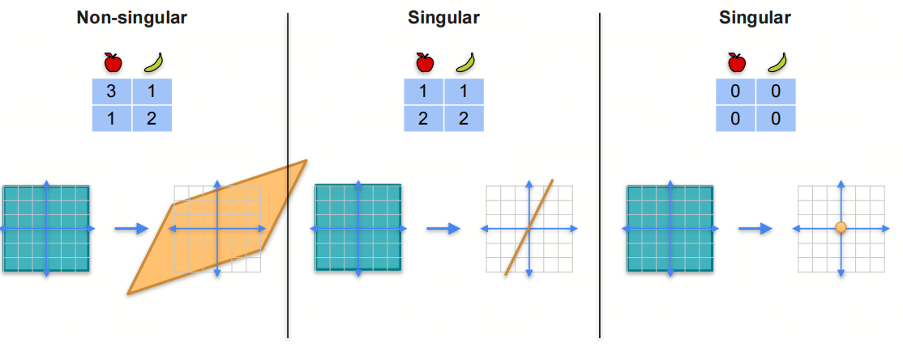
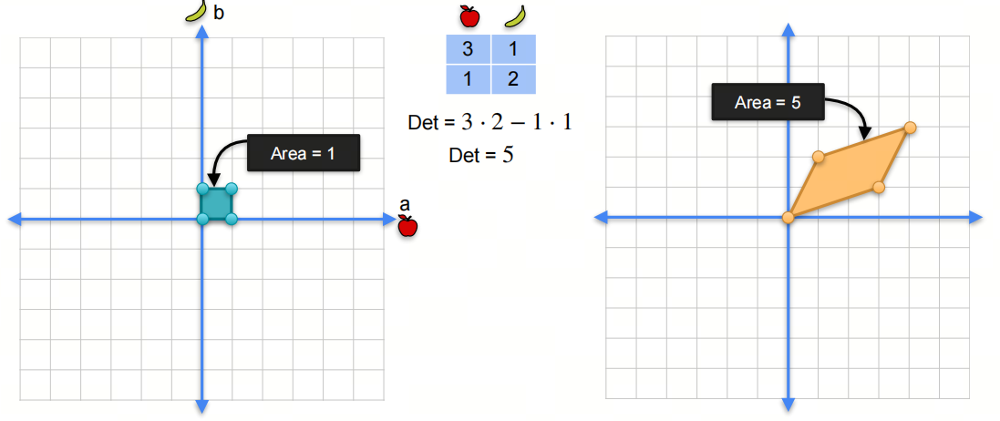
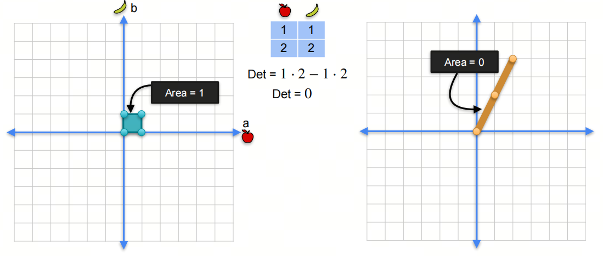
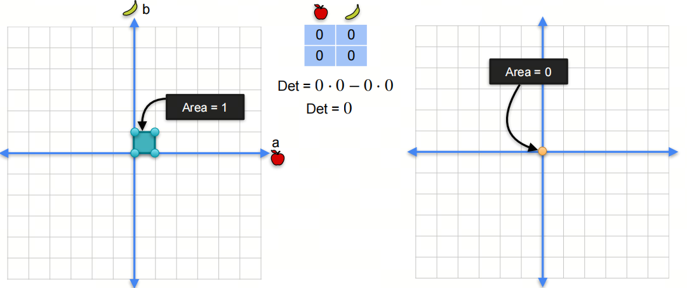

0基础学习AI大模型必备数学知识之线性代数（四）线性变换和行列式

## 1. 系列介绍

AI是理科+工科的交叉学科，牢固的数学知识有助于理解算法的本质。

线性代数是AI领域的基础数学知识之一，掌握线性代数知识对于理解深度学习算法和模型至关重要。本系列将介绍AI大模型必备的线性代数知识，帮助大家更好地理解AI大模型的原理和应用。

我们会着重介绍各种基础概念，关键数学名词会加注英文以求更好的理解。我们也会分享一些大学里老师不会教的小知识，目的是帮助大家建立起对线性代数的直觉式认识。

## 2. 线性变换

### 2.1 奇异和非奇异的线性变换

我们知道矩阵可以看作是一种线性变换，它可以将一个向量空间映射到另一个向量空间。线性变换可以分为奇异和非奇异两种情况。

- **非奇异的线性变换**：如果一个线性变换是双射的，即它是一一对应的，那么这个线性变换就是非奇异的。非奇异的线性变换可以逆转，即可以通过逆变换将输出空间映射回输入空间。

- **奇异的线性变换**：如果一个线性变换不是双射的，即它不是一一对应的，那么这个线性变换就是奇异的。奇异的线性变换不能逆转，即不能通过逆变换将输出空间映射回输入空间。

奇异的线性变换实际上是降维的线性变化，一旦降维后就无法逆转。

### 2.2 线性变换的秩

前面我们已经学过矩阵的秩，矩阵的秩是矩阵的列秩和行秩中的较小值。线性变换的秩是指线性变换的输出空间的维度。

## 3. 行列式

### 3.1 行列式与面积

假设我们有一个线性变换
$$ 
\begin{pmatrix}
3 & 1  \\
1 & 2  
\end{pmatrix}
$$

它可以把一个二维空间中的点映射到另一个二维空间中的点。我们可以看到，原始的四个坐标点$(0,0)$，$(1,0)$，$(0,1)$，$(1,1)$，经过线性变换后，得到新的坐标点$(0,0)$，$(3,1)$，$(1,2)$，$(4,3)$。

原始坐标点的面积是1，新的坐标点的面积是5。我们说这个线性变换将原始的面积扩大了5倍。这个5就是矩阵（线性变换）的行列式。

我们也可以看更多奇异的例子，比如一个矩阵

$$ 
\begin{pmatrix}
1 & 1  \\
2 & 2  
\end{pmatrix}
$$

它的行列式是0，这意味着这个矩阵的线性变换将原始的面积压缩到0，即原始的面积变成了一个线。

另一个例子，一个矩阵

$$ 
\begin{pmatrix}
0 & 0  \\
0 & 0  
\end{pmatrix}
$$

它的行列式是0，这意味着这个矩阵的线性变换将原始的面积压缩到0，即原始的面积变成了一个点。

总结：

### 3.2 矩阵乘积的行列式

对于两个矩阵$A$和$B$，它们乘积的行列式等于它们的行列式的乘积。

$det(AB) = det(A)det(B)$

### 3.3 逆矩阵的行列式

对于一个矩阵$A$，如果它是可逆的，那么它的逆矩阵$A^{-1}$的行列式等于$A$的行列式的倒数。

$det(A^{-1}) = \frac{1}{det(A)}$

### 3.4 单位矩阵的行列式

单位矩阵的行列式是1。

$det(I) = 1$

## 参考

[1] [machine-learning-linear-algebra](https://www.coursera.org/learn/machine-learning-linear-algebra/home/week/4)