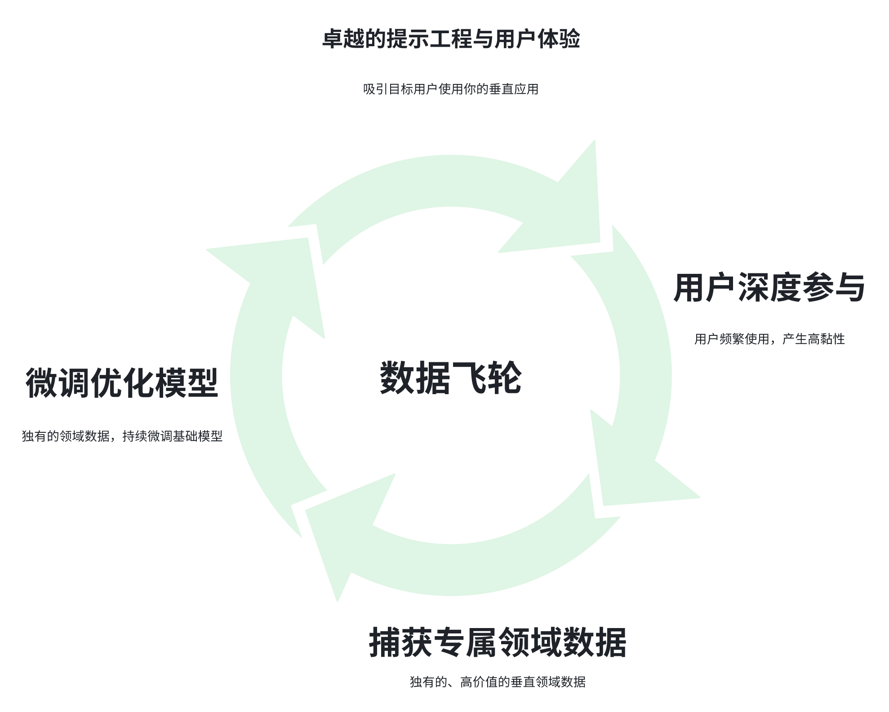

- 拆解→壁垒→核心→捆绑，看懂赢家四步法

生成式AI的火爆毋庸置疑，ChatGPT的横空出世点燃了全球的热情。随之而来的是今年各类“Agent”智能体产品的涌现，表面风光背后，一个残酷的现实是：**​简单的模仿无法建立真正的护城河**。

那么，在这片看似拥挤的红海里，**​谁将成为最终屹立的少数赢家**？​ 如何才能从模仿者跃升为定义未来格局的“平台掌控者”？

围绕这个核心命题，本文尝试描述生成式AI价值捕获的流动路径，并指出了通向成功的四个关键步骤。今天我们就来详细拆解这套“赢家路线图”。

## 1. 第一步：切蛋糕——不做“大而全”，寻找“深而精”（拆分）

基础大模型，如Qwen、Deepseek等，强在“横向通用能力”——能聊天、能写作、能编程。然而，**​真正的用户需求往往是“纵向特定场景”​**​：

- 营销人员需要能产出高转化率文案的AI
- 程序员需要能精准生成并调试代码的AI
- 设计师需要能理解特定风格指令的AI工具

于是，“Agent应用”应运而生。它们本质上是为基础模型穿上特定场景的“外衣”：通过精心设计的提示词工程（Prompt Engineering）、辅助以Agent或者workflow、和用户界面（UI），将通用能力拆解到某个垂直任务中。

意义：​ 降低了用户使用门槛，提供了开箱即用的解决方案。

陷阱：​ **简单的包装壁垒极低，模仿者会蜂拥而至，最终导致同质化竞争**。 仅靠“外衣”不足以成为核心优势。

## 2. 第二步：建壁垒——打造属于你的“数据飞轮”（纵向优势）

如何从“可模仿的包装器”进化到“难以撼动的壁垒”？关键在于构建纵向优势（Vertical Advantage）​​——一个可以自我强化的飞轮闭环：

1. 卓越的提示工程与用户体验：​ 吸引目标用户使用你的垂直应用。
2. 用户深度参与：​ 用户频繁使用，产生高黏性。
3. 捕获专属领域数据：当用户使用你的应用解决特定问题时，你会收集到大量独有的、高价值的垂直领域数据（如律师如何使用AI修改合同模板的具体细节、设计师偏好的风格调整方式等）。这些数据别人无法轻易获得。
4. 微调优化模型：​ 利用这些独有的领域数据，持续微调基础模型，使其在你的专属领域越来越强大、越懂行。
5. 用户体验提升：​ 模型效果越好，用户越满意，使用越频繁，产生更多数据……飞轮持续加速运转。

核心竞争力：​ 这个飞轮的核心在于**领域专有数据的积累与模型迭代能力的结合**。它要求产品团队与技术（模型）团队紧密协作​，能够根据用户实时反馈快速迭代产品与模型。在大型组织中，部门壁垒往往是这条路上的最大阻碍。

小结：​ **通过“拆分”进入市场，通过构建“数据飞轮”在纵向上形成难以逾越的壁垒**。 你不再是“可有可无的包装”，而是深耕某领域、拥有核心竞争力的玩家。

## 3. 第三步：掌核心——找到工作流的“命脉”（核心创造性活动）

建立纵向壁垒（第二步）是立足之本，但要真正捕获巨大价值、让VC心跳加速，则需要迈出更具野心的一步：​重新捆绑（Rebundling）​。

“拆分”如同颠覆，切开了蛋糕；“重新捆绑”则是重塑价值链，成为新蛋糕的中心。

理解“重新捆绑”，微信是最好的例子：
- 起点：“拆分”颠覆传统。 微信最初是作为短信的“垂直替代者”切入（基础沟通工具）。
- 抓住核心横向能力：​ 它迅速掌控了通信和支付这两个普适性极强的横向能力。
- 建立新平台：​ 凭借这两大核心能力，微信在手机操作系统之上构建了一个新平台层。
- ​“重新捆绑”：​ 最终，公众号、小程序、生活服务、游戏等众多功能/服务被捆绑进这个新平台。微信主导了用户与海量服务之间的关系​，成为数字生活的超级枢纽。

在生成式AI领域进行“重新捆绑”，关键在于识别并控制该领域工作流程中最核心的创造性活动（The Core Creative Activity）​​：

- 区分预测型AI vs. 生成型AI：​ 
  - 预测型AI（如推荐算法）的核心是核心决策（Core Decision）​​（决定“推什么”）。
  - 生成型AI的核心在于“创造”。核心创造性活动是那个定义最终产出、最有价值的创造性环节。

- 行业核心在哪里？​ 
  - 建筑设计：方案构思、最终结构安全审核。
  - 药物研发：靶点发现、分子结构设计。
  - 内容创作：核心创意构想的激发与最终成形/审定。
  - 软件开发：核心架构设计、复杂逻辑构建。

谁掌握了这个核心创造性活动，谁就拥有了成为新枢纽的钥匙。其他工具将围绕这个核心构建、集成或依赖。

## 4. 第四步：造枢纽——成为新秩序的“定义者”（重新捆绑）

明确了你要掌控的“核心创造性活动”后，如何将自己打造成该领域的新平台枢纽？需要具备三种关键竞争优势（可叠加）：

1. 场景优势 (Scenario Advantage): 你的产品是否深度嵌入目标场景？​用户是否必须通过你的产品来完成那个核心创造性活动？​ 你控制了核心流程的入口。

2. 智能优势 (Intelligence Advantage): 你是否拥有在该核心活动上表现最佳、专属于此领域的强大模型？​ 这通常得益于你独有的“数据飞轮”积累的专有数据和持续的微调优化。

3. 关系优势 (Relationship Advantage): 你是否与执行该核心活动的关键人物（顶尖设计师、研究员、工程师等）建立了深厚的关系？​ 他们是否信赖你、首选你的工具？

## 5. 赢家路线图：从切入到主导

清晰四步，步步为营：

1. 拆解 (Unbundle)：​ 利用强大的基础模型，切准一个你能立足的垂直市场。

2. 壁垒 (Vertical Advantage)：​ 在垂直领域构建​“数据飞轮”​​，形成难以复制的纵向优势与护城河。

3. 核心 (Core Creative Activity)：​ 识别并锁定该垂直领域工作流中最核心的创造性活动。

4. 捆绑 (Rebundle)：​ 凭借工作流程、智能、关系​（或其组合）的核心优势​，掌控核心活动，成为新枢纽，主导该领域的下一代价值链。

## 6. 思考：你的战场在哪里？

回到你所关注或深耕的行业：

1. 那个最具价值的“核心创造性活动”究竟是什么？是方案构思？是结构设计？是基因筛选？还是创意定调？​

2. 环顾四周，谁（现有巨头、新锐玩家、或者……你自己）最有可能利用AI赋能甚至掌控这个核心活动？​

3. 他们/你，又能否成功完成“重新捆绑”，成为定义未来的关键枢纽？​

## 参考

[GitHub: LLMForEverybody](https://github.com/luhengshiwo/LLMForEverybody)
