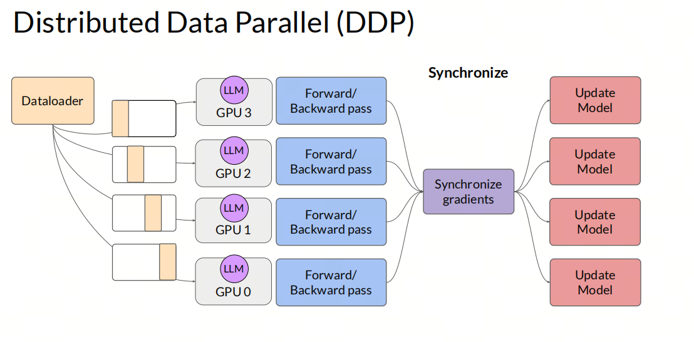
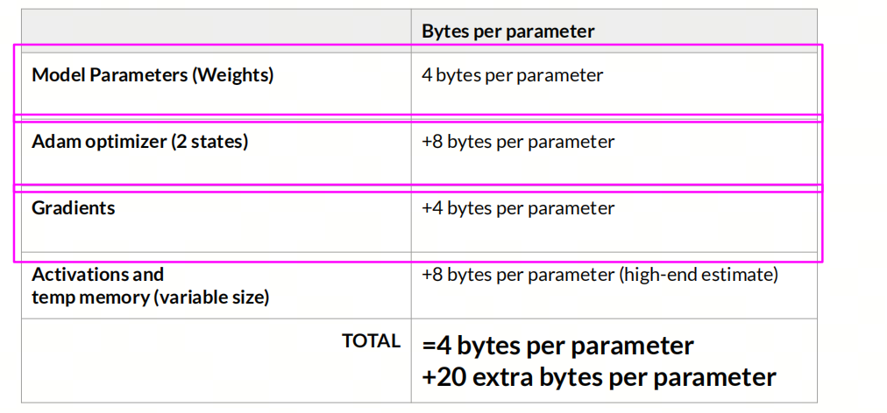

Transformer架构的GPU并行和之前的NLP算法并行有什么不同？

## 1. 什么是GPU并行计算？

GPU并行计算是一种利用图形处理单元（GPU）进行大规模并行数据处理的技术。与传统的中央处理单元（CPU）相比，GPU拥有更多的核心，能够同时处理数千个线程，这使得GPU在处理高度并行的任务时表现出色。在深度学习中，GPU并行计算被广泛应用于训练神经网络，加速模型训练过程。

在2017年之前，自然语言处理（NLP）领域的研究者们通常会从头开始训练模型，那时能够利用GPU进行训练就已经算是先进的配置了。尽管有些研究者拥有多张GPU，但他们往往不会投入精力去实现并行计算，因为当时的模型规模相对较小，训练过程也相对较快，因此并行计算的额外投入似乎并不划算。

然而，随着时间的推移，大型语言模型（LLM）开始崭露头角，这些模型拥有庞大的参数量，训练过程也变得漫长而复杂。为了有效应对这些挑战，使用多张GPU进行训练变得司空见惯，而并行计算技术也变得不可或缺。特别是考虑到Transformer模型的独特架构，传统的并行计算方法需要进行相应的调整和优化，以适应这种新型模型的需求。

## 2.并行计算的类型

在深度学习中，GPU并行计算主要分为两种类型：数据并行和模型并行。

- ***Distributed Data Parallel (DDP)*** 数据并行指的是模型不大,完全可以load到单张GPU内存中,所以为了加速训练,将数据分成多份,分别加载到多张GPU上,每张GPU上的模型参数是一样的,每个batch的数据在不同的GPU上进行计算,然后将梯度汇总进行参数更新。

- 模型并行指的是模型太大,无法完全加载到单张GPU内存中,所以将模型分成多份,分别加载到多张GPU上,每张GPU上的模型参数不同,每个batch的数据在不同的GPU上进行计算,然后将梯度汇总进行参数更新。

## 3. 什么需要加载到GPU显存中？

在大模型中,我们需要加载的主要有以下几个部分：

- 模型参数
- 模模型的优化器状态:包含前向和反向的状态
- 模型的梯度
- 模型的其它中间状态

需要注意一点:下图中展示的都是以FP32为例的情况.在真实的训练中,我们也许会在模型参数上使用FP16,在梯度上使用FP32等混合精度.某些文章和测评没有显示的表示是否使用混合精度,所以在计算显存占比的时候会有出入.

## 4. FSDP

***Fully Sharded Data Parallel (FSDP)***

FSDP（Fully Sharded Data Parallel）是一种先进的数据并行技术，它允许在多个GPU上高效地训练大型模型。FSDP最早由FairScale-FSDP提出，并在PyTorch 1.11版本中被集成。它与微软Deepspeed框架中的ZERO算法中的ZERO-3级别相似。

在传统的数据并行（DDP）中，每个GPU都会保存整个模型的参数、梯度和优化器状态，然后数据集被分割成多个分片（shards），每个GPU负责训练其中的一部分。在计算完梯度后，通过all-reduce操作来合并梯度。

FSDP的核心思想是对模型的梯度、优化器状态和参数进行分片，使得每个GPU只存储部分参数信息。这样做的关键在于将DDP中的all-reduce操作分解为reduce-scatter和all-gather操作。在FSDP的前向传播中，每个GPU需要通过all-gather操作来获得完整的参数，然后进行计算，并在计算后丢弃其他分片的参数。在反向传播中，同样需要通过all-gather操作来获得完整的参数，并计算出本地batch的梯度。最后，通过reduce-scatter操作在设备上进行梯度的均值计算和分片，每个设备只更新其对应的参数分片.

FSDP 有四种模式：

- stage0: 退化为DDP
- stage1: 只分片模型优化器状态
- stage2: 分片模型梯度和优化器状态
- stage3: 分片模型梯度、优化器状态和参数

## 5. Offload

Offload是一种将模型的一部分参数从GPU内存中移动到CPU内存中的技术。在训练大型模型时，由于模型参数量巨大，有时候会导致GPU内存不足的问题。为了解决这个问题，可以使用Offload技术将部分参数从GPU内存中移动到CPU内存中，从而释放GPU内存，使得模型能够继续训练。

FSDP中的Offload技术可以将模型的一部分参数从GPU内存中移动到CPU内存中.

## 6. 总结
Transformer的一个很大的优点是可以很好的利用GPU的并行计算能力,在训练大型模型时,需要考虑到模型的参数量和GPU的内存限制,这时候就需要使用FSDP和Offload等技术来优化训练过程,提高训练效率。

## 参考

[1] [ZeRO: Memory Optimizations Toward Training Trillion Parameter Models](https://arxiv.org/abs/1910.02054)

[2] [pytorch_FSDP_tutorial](https://pytorch.org/tutorials/intermediate/FSDP_tutorial.html)

## 欢迎关注我的GitHub和微信公众号，来不及解释了，快上船！

[GitHub: LLMForEverybody](https://github.com/luhengshiwo/LLMForEverybody)

仓库上有原始的Markdown文件，完全开源，欢迎大家Star和Fork！