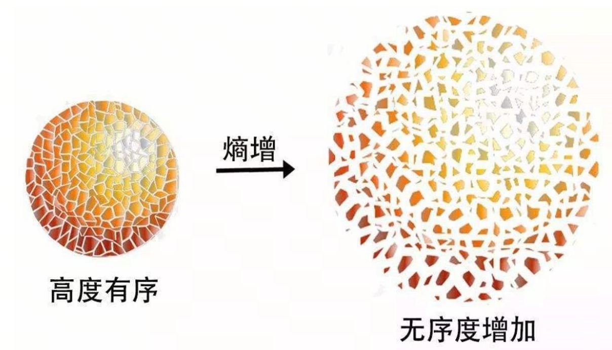
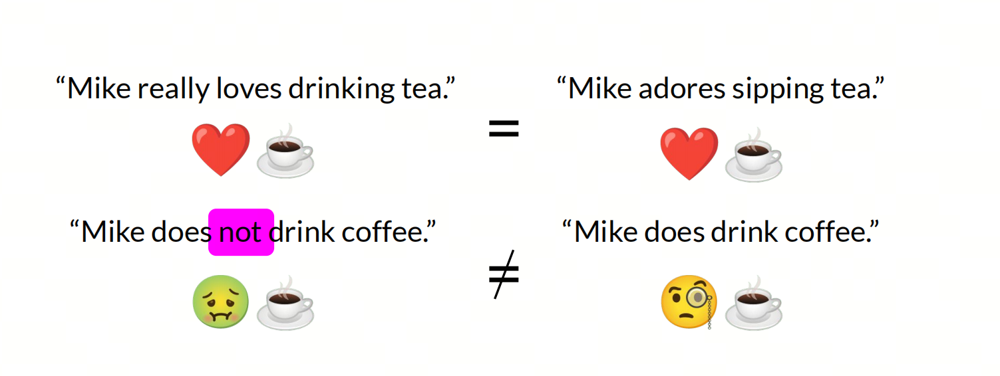
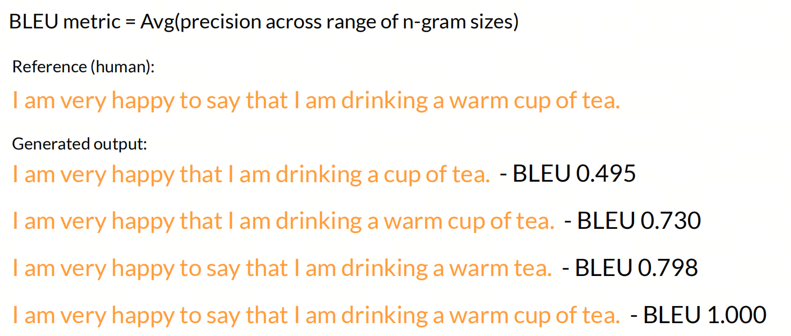
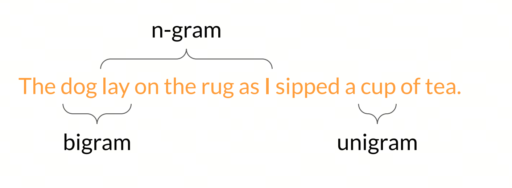
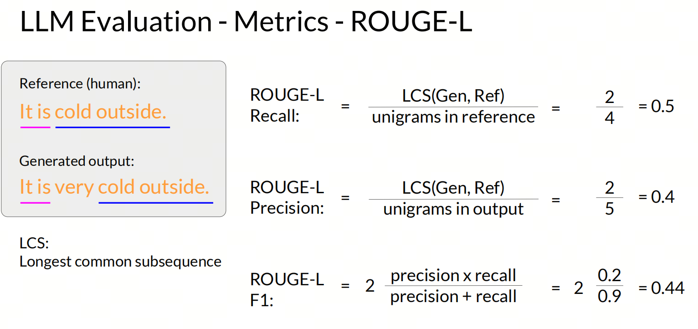
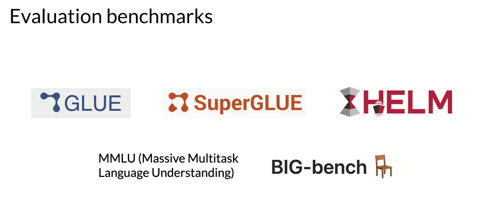

大模型有哪些评估指标？

## 1. 导入
你可能听说过A大模型比B大模型好，但你知道如何评估这些模型吗？在大模型领域，有许多指标可以帮助我们评估模型的性能。这些指标可以帮助我们了解模型的准确性、效率和可解释性。在本文中，我们将介绍一些常用的指标，以及如何使用它们来评估模型的性能。

- 在训练大模型的时候，我们需要一个目标函数（损失函数）来指导大模型进行梯度下降；
- 训练后，我们会使用Bleu或者Rouge等指标来评估模型的性能；
- 在正式发布前，我们会使用各种Benchmarks来评估模型的性能，如GLUE、SuperGLUE、SQuAD、CoLA等；
- 最后，我们会在竞技场上与其他模型进行比较，以确定模型的性能。

下面，我们分别从这四个方面来介绍LLM的评估指标。

## 2. Cross Entropy 交叉熵

### 熵

熵（Entropy）是一个物理学和信息论中非常重要的概念，它最初来自热力学第二定律，用来描述系统的无序程度或能量分布的均匀性。在不同的学科领域，熵有着不同的含义和应用：

- 热力学中的熵：热力学中的熵是一个状态函数，表示系统的能量分布的无序性。一个系统的熵增加通常表示系统变得更加无序。热力学第二定律表明，封闭系统的熵总是倾向于增加，直至达到热力学平衡；

- 信息论中的熵：克劳德·香农将熵的概念引入信息论，定义为信息的不确定性度量。在信息论中，熵用来量化信息的预期值，一个信息源的熵越高，其包含的信息就越不确定，信息内容的不确定性越大；

- 统计学和概率论中的熵：在统计学和概率论中，熵可以被看作是随机变量不确定性的度量。如果一个随机变量的可能结果是完全等可能的，那么它的熵就达到最大值。

熵的数学定义通常如下：

- 对于离散随机变量  X ，其概率分布为 P(x) ，熵 H(X) 的定义为：
$H(X) = -\sum_{x} P(x)log_b P(x)$

- 对于连续随机变量 X ，其概率密度函数为  p(x) ，熵 H(X) 的定义为：
$H(X) = -\int p(x)log_b p(x)dx$

在这两个公式中 b 是对数的底数，常用的底数是 2，此时熵的单位是比特bit。

### 文学作品的熵

> 这边可以插入天下霸唱的例子，注意：在知乎上可以插入天下霸唱的例子，其它的平台不插入

很多文学作品中也有“熵”的影子，比如天下霸唱的《地底世界》的幕后大Boss就是“熵”，《地底世界》是天下霸唱继《鬼吹灯》之后的又一部长篇系列探险小说。它讲述了名不见经传的主人公跟随一支肩负神秘使命的探险队深入地下世界，由此展开了一段惊心动魄的死亡之旅。作者天下霸唱被称为中国最具想象力的作家，具有强劲的市场号召力，作品故事精彩，包罗万象，引人入胜。

20世纪60年代，司马灰和罗大海在黑屋地区成为帮派的首领，后在朋友的哥哥夏铁东的影响和劝说下，加入了缅共游击队。征战多年后，以司马灰、罗大海为首的缅共游击队员，退至野人山，被迫加入了玉飞燕带领的探险队，为寻找一件深藏地底的神秘货物而历尽艰险，展开一段惊心动魄的生死之旅。一行人闯进“幽灵公路”，被热带风团“浮屠”追赶，遭遇巨蟒和食人水蛭的侵袭，又掉进了野人山巨型裂谷。他们受雇于人，但不知雇主付出一切代价要寻找的货物究竟是什么，却意外发现了浓雾之下消失了千年的占婆王建造的黄金蜘蛛城。。。。。。

### 交叉熵
交叉熵（Cross-Entropy）是机器学习和信息理论中的一个重要概念，常用于衡量两个概率分布之间的差异。在分类问题中，交叉熵通常用于评估模型的预测结果与实际标签之间的差异。

交叉熵的公式通常表示为：

$H(p, q) = -\sum_{i} p(i) \log q(i)$

>其中：
p 是实际的概率分布;
q 是预测的概率分布;
i 是类别索引。

在二分类问题中，交叉熵损失函数的公式可以简化为：

$H(p, q) = -[p \log q + (1 - p) \log (1 - q)]$

>其中：
p 是实际标签（0 或 1）;
q 是模型预测的概率。

在多分类问题中，交叉熵损失函数的公式为：

$H(p, q) = -\sum_{i=1}^{N} p_i \log q_i$

>其中：
N 是类别的数量。
p_i是实际类别 i 的概率（通常为 0 或 1）。
q_i是模型预测类别 i 的概率。

### perplexity

Perplexity字面意思是困惑度，是度量语言模型好坏的一种metric。它的取值范围是1-可选字典长度，困惑度的意思是语言模型在做next-token-prediction的时候，有多困惑。比如Perplexity=81，意味着模型在做下一个token预测的时候，要从81个候选字中选出正确答案，模型的困惑度为81。

给定测试集W = w1,w2,w3,...wm

困惑度定义为测试集的概率的倒数，并用单词数做归一化。

第一个单词的概率是p(w1),第二个是p(w2),第m个是p(wm),PP(W)就等于这些概率倒数的几何平均。

### Perplexity的另一种解释

假设我有1个红球，80个黑球，获取到红球的概率就是1/81，也代表要从81个里面找到正确的（倒数），困惑度就是81。

1个红球代表正确的单词，80个黑球代表模型的能力，模型能力越强，越能把黑球排除干净。最强的模型是只有一个红球没有黑球----困惑度为1。

## 3. Bleu Score & Rouge Score

在NLP领域，直接使用precision、recall和F1-score等传统的评价指标往往无法很好地评估生成式模型的性能，因为生成式模型的输出是自然语言文本，不同的文本可能有不同的表达方式，但意思相同。因此，需要一些特定的评价指标来评估生成式模型的性能。

BLEU（Bilingual Evaluation Understudy）和ROUGE（Recall-Oriented Understudy for Gisting Evaluation）是自然语言处理中用于评估机器翻译和文本摘要的两个重要指标。

BLEU 是一种基于n-gram的评估方法，通过比较机器翻译输出与一组参考翻译之间的重叠度来评估翻译质量。BLEU的核心在于计算候选翻译与参考翻译中相同n-gram的数量，并给予较高的权重。它的优点是简单易用，能够快速评估翻译文本的质量，但它对翻译的语义相似度不太敏感，容易受到n元语法覆盖率的影响。

ROUGE 则是基于召回率的评估指标，主要用于自动文摘和机器翻译的质量评估。ROUGE通过比较生成的摘要或翻译与参考摘要或翻译之间的n-gram重叠度来评估生成结果的质量。ROUGE包括多个变体，如ROUGE-N（基于n-gram的召回率）、ROUGE-L（基于最长公共子序列的评估）等。ROUGE的优点是更注重语义相似度，但在评估时计算复杂度较高，对句子结构差异较为敏感。

**N-gram**

N-gram是自然语言处理中常用的一种特征表示方法，它将文本分割成长度为N的连续子序列，并将这些子序列作为特征。N-gram模型通常用于语言建模、文本分类、机器翻译等任务中。

单个词称为unigram，两个词组成的序列称为bigram，多个词组成的序列称为n-gram。

**Rouge-N**
ROUGE-N基于n-gram的重叠来计算，其中"N"指的是n-gram的大小，即连续的N个元素（通常是单词）序列。

ROUGE-N的计算方法主要关注召回率，即系统生成的文本中有多少n-gram也出现在参考文本中.

**Rouge-L**
ROUGE-L是基于最长公共子序列（Longest Common Subsequence）的评估方法，它考虑了系统生成的文本和参考文本之间的最长公共子序列。

## 4. Benchmarks

大模型的benchmarks，即基准测试，是用来评估和比较大型语言模型（LLM）性能的标准测试集和指标。这些基准测试可以全面地评估模型在不同领域和任务上的能力，包括但不限于知识理解、逻辑推理、多轮对话、编程能力等。

例如，General Language Understanding Evaluation (GLUE) benchmark 是一个著名的自然语言理解评估集合，包含多个任务，并使用不同的数据集来评估模型在各种文本类型和难度级别上的表现。

在中文领域，有专门针对中文大模型的基准测试，如CMMLU，它包含67个不同学科的题目，覆盖自然科学、社会科学、工程、人文和常识等，旨在全面评估模型在中文知识储备和语言理解上的能力。

此外，还有一些基准测试专注于特定领域，比如MathEval，它是一个全面评估大模型数学解题能力的测评基准，包含20个数学领域测评集和近30K道数学题目，覆盖从算术到高等数学的多个分支。

## 5. Arena
说到Arena，最先想到的是什么？

大模型竞技场是一个为LLM提供的性能比较平台，它允许不同来源的大型模型在相同的任务和数据集上进行测试，以评估和比较它们的性能。这种竞技场可以为研究人员、开发人员以及最终用户提供一个直观的方法来衡量和选择最优的AI服务。

如LMSys Chatbot Arena Leaderboard这样的评测排行榜，它采用众包的方式对大模型进行匿名评测，用户可以输入问题，然后由一个或多个匿名的大模型同时返回结果，用户根据自己的期望对效果进行投票，最终形成不同的大模型众包的评测结果。

## 参考

[1] [LMSYS Chatbot Arena Leaderboard](https://huggingface.co/datasets/lmsys/lmsys-chat-1m)

[2] [deeplearning.ai](https://www.deeplearning.ai/courses/generative-ai-with-llms/)

## 欢迎关注我的GitHub和微信公众号：

[GitHub: LLMForEverybody](https://github.com/luhengshiwo/LLMForEverybody)