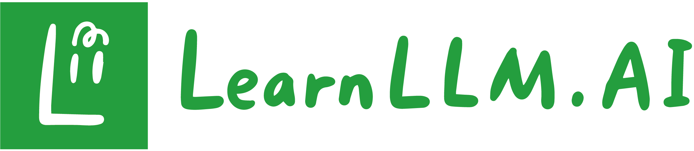

 

 
  
  &nbsp;
  
  &nbsp;
  
  &nbsp;
  

<strong>Learning LLM is all you need.</strong>

  <a href="README.md">中文</a> | <a href="README.en.md">English</a> | Русский

<strong>👉 Перейти на <a href="https://learnllm.ai?ref=github">LearnLLM.AI</a> | Изучайте LLM, начав отсюда</strong>

<strong>Русская карта материалов: <a href="docs/ru/index.md">docs/ru</a></strong>

## Ключевые преимущества LearnLLM.AI

 **Подборка вопросов для собеседований по LLM**: практические задачи от базовых тем до передовых направлений, которые помогают готовиться к поиску работы и использовать карьерные возможности;

 **Системное чтение научных статей**: от основополагающей статьи Transformer 2017 года до дальнейшей эволюции технологий, разложенной по понятной структуре для разработчиков с разным уровнем подготовки.

**Специальный промокод**

Для пользователей GitHub действует временный промокод: ***GITHUB50***. Будем рады продолжить обучение вместе с вами на [LearnLLM.AI](https://learnllm.ai?ref=github)!

**Видео-уроки (постоянно обновляются)**:

👉 Смотреть на [bilibili](https://space.bilibili.com/37863979/lists?sid=7144646)   

👉 Смотреть на [YouTube](https://www.youtube.com/@learnllm-ai)

*Если у вас есть вопросы, свяжитесь с нами в любое время.*

*Happy Learning!*

*Команда LearnLLM.AI*

---

## Избранные статьи по LLM

| Время | Статья | Описание | Видео | Начать обучение |
| --- | --- | --- | --- | --- |
| 2017-06-12 | [Transformer](https://arxiv.org/abs/1706.03762) | Самовнимание и архитектура Transformer |  |  |
| 2018-06-11 | [GPT-1](https://cdn.openai.com/research-covers/language-unsupervised/language_understanding_paper.pdf) | Генеративный Transformer: предварительное обучение + тонкая настройка |  |  |
| 2018-10-11 | [BERT](https://arxiv.org/abs/1810.04805) | Двунаправленный encoder: MLM + NSP |  |  |
| 2019-02-14 | [GPT-2](https://cdn.openai.com/better-language-models/language_models_are_unsupervised_multitask_learners.pdf) | Масштабная безнадзорная генерация текста |  |  |
| 2019-10-23 | [T5](https://arxiv.org/abs/1910.10683) | Единый подход text-to-text |  |  |
| 2020-05-28 | [GPT-3](https://arxiv.org/abs/2005.14165) | Большие модели и способность к few-shot learning |  |  |
| 2020-10 | [ViT](https://arxiv.org/abs/2010.11929) | Перенос Transformer-магистрали в компьютерное зрение |  |  |
| 2021-02 | [ViLT](https://arxiv.org/abs/2102.03334) | Минималистичная архитектура визуально-языкового pretraining |  |  |
| 2021-02 | [CLIP](https://arxiv.org/abs/2103.00020) | Zero-shot визуальное обучение с надзором естественного языка |  |  |
| 2021-02 | [DALL·E 1](https://arxiv.org/abs/2102.12092) | Начало авторегрессионной генерации изображений по тексту |  |  |
| 2021-07-07 | [CodeX](https://arxiv.org/abs/2107.03374) | GPT-модель для генерации кода |  |  |
| 2021-12 | [Stable Diffusion](https://arxiv.org/abs/2112.10752) | Latent diffusion и открытая экосистема text-to-image |  |  |
| 2022-02-08 | [AlphaCode](https://arxiv.org/abs/2203.07814) | Система генерации кода соревновательного уровня |  |  |
| 2022-03-04 | [InstructGPT](https://arxiv.org/abs/2203.02155) | Выравнивание по человеческой обратной связи и instruction tuning |  |  |
| 2022-04 | [DALL·E 2](https://arxiv.org/abs/2204.06125) | Высокоточная генерация изображений на основе CLIP Latents |  |  |
| 2022-12 | [Whisper](https://arxiv.org/abs/2212.04356) | Базовая модель распознавания речи с масштабным слабым надзором |  |  |
| 2023-02-27 | [LLaMA-1](https://arxiv.org/pdf/2302.13971) | Эффективная открытая базовая pretraining-модель |  |  |
| 2023-04 | [LLaVA](https://arxiv.org/abs/2304.08485) | Важная отправная точка для открытого мультимодального instruction tuning |  |  |
| 2023-07-18 | [LLaMA-2](https://arxiv.org/abs/2307.09288) | Обновление LLaMA с разрешением на коммерческое использование |    |  |
| 2023-08 | [Qwen-VL](https://arxiv.org/abs/2308.12966) | Ранняя визуально-языковая базовая модель Qwen |  |  |
| 2023-09-28 | [Qwen 1](https://arxiv.org/abs/2309.16609) | Первое поколение базовой модели Qwen |  |  |
| 2023-10-10 | [Mistral 7B](https://arxiv.org/abs/2310.06825) | Эффективная открытая модель класса 7B |  |  |
| 2023-12 | [LVM](https://arxiv.org/abs/2312.00785) | Направление больших визуальных моделей с чистым визуальным авторегрессионным моделированием |  |  |
| 2024-02 | [Mixtral 8x7B](https://arxiv.org/abs/2401.04088) | Знаковая открытая sparse MoE-модель |  |  |
| 2024-03 | [Gemma 1](https://arxiv.org/abs/2403.08295) | Первый выпуск легкого открытого семейства моделей Google |  |  |
| 2024-05 | [DeepSeek-V2](https://arxiv.org/abs/2405.04434) | Эффективная MoE-языковая модель с балансом качества и стоимости инференса |  |  |
| 2024-06 | [ChatGLM](https://arxiv.org/abs/2406.12793) | Китайское семейство моделей от GLM-130B до GLM-4 |  |  |
| 2024-07 | [Llama 3](https://arxiv.org/abs/2407.21783) | Новое поколение открытых флагманских моделей Meta |  |  |
| 2024-07 | [Gemma 2](https://arxiv.org/abs/2408.00118) | Дальнейшее улучшение качества открытых моделей практичных размеров |  |  |
| 2025-03 | [Gemma 3](https://arxiv.org/abs/2503.19786) | Нативная мультимодальность и контекст 128K в Gemma |  |  |
Продолжение следует...

Развернуть/свернуть

## Путь к AGI

Развернуть/свернуть

### Содержание

- 🐳[Пролог: путь к AGI](#prologue-agi-road)
- 🐱[Глава 1: Pre-Training LLM](#chapter-1-pre-training)
  - 🐼[Архитектура](#architecture)
  - 🐹[Оптимизаторы](#optimizers)
  - 🐰[Функции активации](#activation-functions)
  - 🐭[Attention](#attention)
  - 🐯[Позиционное кодирование](#position-encoding)
  - 🐨[Tokenizer](#tokenizer)
  - 🐻[Стратегии параллелизма](#parallel-strategies)
  - 🐷[Фреймворки обучения LLM](#llm-training-frameworks)
- 🐶[Глава 2: Развертывание и инференс LLM](#chapter-2-deployment-inference)
- 🐯[Глава 3: Тонкая настройка LLM](#chapter-3-fine-tuning)
- 🐻[Глава 4: Квантизация LLM](#chapter-4-quantization)
- 🐼[Глава 5: GPU и параллелизм для LLM](#chapter-5-gpu-parallelism)
- 🐨[Глава 6: Prompt Engineering](#chapter-6-prompt-engineering)
- 🦁[Глава 7: Agent](#chapter-7-agent)
  - 🐷[RAG](#rag)
- 🐘[Глава 8: Корпоративное внедрение LLM](#chapter-8-enterprise-adoption)
- 🐰[Глава 9: Метрики оценки LLM](#chapter-9-evaluation-metrics)
- 🐷[Глава 10: Актуальные темы](#chapter-10-hot-topics)
- 🦁[Глава 11: Математика](#chapter-11-mathematics)

### Пролог: путь к AGI

**[⬆ Вернуться к содержанию](#contents)** 

#### Годовые обзоры статей по LLM

[2017: появился Transformer, и все началось отсюда](00-序-AGI之路/大模型年度论文总结/2017.md)

[2018: GPT и BERT, pretraining расходится на два направления](00-序-AGI之路/大模型年度论文总结/2018.md)

[2019: модели становятся больше, GPT-2 и T5](00-序-AGI之路/大模型年度论文总结/2019.md)

[2020: пришел GPT-3, что дали 175 миллиардов параметров](00-序-AGI之路/大模型年度论文总结/2020.md)

[2021: не только текст, CLIP учит модели видеть изображения](00-序-AGI之路/大模型年度论文总结/2021.md)

[2022: модели становятся послушнее, InstructGPT и RLHF](00-序-AGI之路/大模型年度论文总结/2022.md)

[2023: после выхода LLaMA открытые модели начали догонять](00-序-AGI之路/大模型年度论文总结/2023.md)

[2024: открытые модели заново считают стоимость обучения и инференса](00-序-AGI之路/大模型年度论文总结/2024.md)

[Что такое Scaling Law, о котором все говорят](00-序-AGI之路/大家都在谈的ScalingLaw是什么.md)

[Эмерджентность интеллекта и истоки AGI](00-序-AGI之路/智能涌现和AGI的起源.md)

[Что такое perplexity](https://mp.weixin.qq.com/s?__biz=MzkyOTY4Mjc4MQ==&mid=2247483766&idx=1&sn=56563281557b6f58feacb935eb6a872a&chksm=c2048544f5730c52cf2bf4c9ed60ac0a21793bacdddc4d63b481d4aa887bc6a838fecf0b6cc7&token=607452854&lang=zh_CN#rd)

[Pre-Training Llama-3.1 405B: сколько вычислительных ресурсов нужно?](https://mp.weixin.qq.com/s?__biz=MzkyOTY4Mjc4MQ==&mid=2247483839&idx=1&sn=3f35dfe8ed2c87bf4c0b4ac7bfa3e6a9&chksm=c204858df5730c9b8a152a0330dee0183467a063c25aadd0da7cc47d9d5b2f97347fab22708d&token=607452854&lang=zh_CN#rd)

### Глава 1: Pre-Training LLM

**[⬆ Вернуться к содержанию](#contents)** 

#### Архитектура

[За 10 минут: почему в Transformer используется LayerNorm, а не BatchNorm](01-第一章-预训练/10分钟搞清楚为什么Transformer中使用LayerNorm而不是BatchNorm.md)

[Разбор MoE, mixture of experts, фрагмент](01-第一章-预训练/混合专家模型MoE详解节选.md)

[Самый простой способ понять Mamba, перевод на китайский](01-第一章-预训练/最简单的方式理解Mamba（中文翻译）.md)

[За 10 минут: что такое мультимодальная LLM](01-第一章-预训练/10分钟了解什么是多模态大模型.md)

#### Оптимизаторы

[Самый полный обзор optimizer для нейросетей](01-第一章-预训练/全网最全的神经网络优化器optimizer总结.md)

[Оптимизаторы нейросетей (1): обзор](01-第一章-预训练/神经网络的优化器（一）概述.md)

[Оптимизаторы нейросетей (2): SGD](01-第一章-预训练/神经网络的优化器（二）SGD.md)

[Оптимизаторы нейросетей (3): Momentum](01-第一章-预训练/神经网络的优化器（三）Momentum.md)

[Оптимизаторы нейросетей (4): ASGD](01-第一章-预训练/神经网络的优化器（四）ASGD.md)

[Оптимизаторы нейросетей (5): Rprop](01-第一章-预训练/神经网络的优化器（五）Rprop.md)

[Оптимизаторы нейросетей (6): AdaGrad](01-第一章-预训练/神经网络的优化器（六）AdaGrad.md)

[Оптимизаторы нейросетей (7): AdaDeleta](01-第一章-预训练/神经网络的优化器（七）AdaDeleta.md)

[Оптимизаторы нейросетей (8): RMSprop](01-第一章-预训练/神经网络的优化器（八）RMSprop.md)

[Оптимизаторы нейросетей (9): Adam](01-第一章-预训练/神经网络的优化器（九）Adam.md)

[Оптимизаторы нейросетей (10): Nadam](01-第一章-预训练/神经网络的优化器（十）Nadam.md)

[Оптимизаторы нейросетей (11): AdamW](01-第一章-预训练/神经网络的优化器（十一）AdamW.md)

[Оптимизаторы нейросетей (12): RAdam](01-第一章-预训练/神经网络的优化器（十二）RAdam.md)

#### Функции активации

[Почему большие языковые модели используют SwiGLU как функцию активации](01-第一章-预训练/为什么大型语言模型都在使用SwiGLU作为激活函数？.md)

[Функции активации нейросетей (1): обзор](01-第一章-预训练/神经网络的激活函数（一）概述.md)

[Функции активации нейросетей (2): Sigmiod, Softmax и Tanh](01-第一章-预训练/神经网络的激活函数（二）Sigmiod、Softmax和Tanh.md)

[Функции активации нейросетей (3): ReLU и ее варианты](01-第一章-预训练/神经网络的激活函数（三）ReLU和它的变种.md)

[Функции активации нейросетей (4): ELU и ее вариант SELU](01-第一章-预训练/神经网络的激活函数（四）ELU和它的变种SELU.md)

[Функции активации нейросетей (5): семейство gating, GLU, Swish и SwiGLU](01-第一章-预训练/神经网络的激活函数（五）门控系列-GLU、Swish和SwiGLU.md)

[Функции активации нейросетей (6): GELU и Mish](<01-第一章-预训练/神经网络的激活函数（六）GELU和Mish.md>)

#### Attention

[Какая математика нужна, чтобы понять FlashAttention: последняя задача китайского экзамена gaokao](01-第一章-预训练/看懂FlashAttention需要的数学储备是？高考数学最后一道大题！.md)

[Что изменилось во FlashAttention v2 по сравнению с v1](<01-第一章-预训练/FlashAttentionv2相比于v1有哪些更新？.md>)

[Почему появились Multi-Query-Attention и Group-Query-Attention](<01-第一章-预训练/为什么会发展出Multi-Query-Attention和Group-Query-Attention.md>)

[Технология MLA в серии DeepSeek](01-第一章-预训练/一文了解Deepseek系列中的MLA技术.md)

#### Позиционное кодирование

[Что такое Position-Encoding в LLM](<01-第一章-预训练/什么是大模型的位置编码Position-Encoding.md>)

[Применение комплексного анализа в позиционном кодировании LLM](01-第一章-预训练/复变函数在大模型位置编码中的应用.md)

[Самая красивая математическая формула: формула Эйлера](01-第一章-预训练/最美的数学公式-欧拉公式.md)

[От красоты формулы Эйлера к RoPE](01-第一章-预训练/从欧拉公式的美到旋转位置编码RoPE.md)

#### Tokenizer

[Самый полный обзор Tokenizer для LLM](01-第一章-预训练/全网最全的大模型分词器（Tokenizer）总结.md)

[Разбираемся с Tokenizer в LLM (1)](01-第一章-预训练/搞懂大模型的分词器（一）.md)

[Разбираемся с Tokenizer в LLM (2)](01-第一章-预训练/搞懂大模型的分词器（二）.md)

[Разбираемся с Tokenizer в LLM (3)](01-第一章-预训练/搞懂大模型的分词器（三）.md)

[Разбираемся с Tokenizer в LLM (4)](01-第一章-预训练/搞懂大模型的分词器（四）.md)

[Разбираемся с Tokenizer в LLM (5)](01-第一章-预训练/搞懂大模型的分词器（五）.md)

[Разбираемся с Tokenizer в LLM (6)](01-第一章-预训练/搞懂大模型的分词器（六）.md)

#### Стратегии параллелизма

[Стратегии параллелизма для LLM, перевод на китайский](01-第一章-预训练/大模型并行策略[中文翻译].md)

[Технологии распределенного обучения LLM (1): обзор](01-第一章-预训练/大模型分布式训练并行技术（一）概述.md)

[Технологии распределенного обучения LLM (2): data parallelism](01-第一章-预训练/大模型分布式训练并行技术（二）数据并行.md)

[Технологии распределенного обучения LLM (3): pipeline parallelism](01-第一章-预训练/大模型分布式训练并行技术（三）流水线并行.md)

[Технологии распределенного обучения LLM (4): tensor parallelism](01-第一章-预训练/大模型分布式训练并行技术（四）张量并行.md)

[Технологии распределенного обучения LLM (5): hybrid parallelism](01-第一章-预训练/大模型分布式训练并行技术（五）混合并行.md)

#### Фреймворки обучения LLM

[Фреймворки обучения LLM (1): обзор](01-第一章-预训练/大模型训练框架（一）综述.md)

[Фреймворки обучения LLM (2): FSDP](01-第一章-预训练/大模型训练框架（二）FSDP.md)

[Фреймворки обучения LLM (3): DeepSpeed](01-第一章-预训练/大模型训练框架（三）DeepSpeed.md)

[Фреймворки обучения LLM (4): Megatron-LM](01-第一章-预训练/大模型训练框架（四）Megatron-LM.md)

[Фреймворки обучения LLM (5): Accelerate](01-第一章-预训练/大模型训练框架（五）Accelerate.md)

### Глава 2: Развертывание и инференс LLM

**[⬆ Вернуться к содержанию](#contents)**

[За 10 минут: приватное развертывание LLM локально](02-第二章-部署与推理/10分钟私有化部署大模型到本地.md)

[Развертывание модели без посторонней помощи: формулы оценки производительности от TTFT до Throughput](02-第二章-部署与推理/模型部署不求人！从TTFT到Throughput的性能估算终极公式.md)

[Почему output-token в LLM дороже input-token](<02-第二章-部署与推理/大模型output-token为什么比input-token贵？.md>)

[Как оценивать скорость вывода LLM: чем задержка первого Token отличается от задержки остальных Token](02-第二章-部署与推理/如何评判大模型的输出速度？首Token延迟和其余Token延迟有什么不同？.md)

[Чем отличаются latency и throughput у LLM](02-第二章-部署与推理/大模型的latency（延迟）和throughput（吞吐量）有什么区别.md)

[Как vLLM использует PagedAttention для простого, быстрого и дешевого обслуживания LLM, перевод на китайский](<02-第二章-部署与推理/vLLM使用PagedAttention轻松、快速且廉价地提供LLM服务（中文版翻译）.md>)

[DevOps, AIOps, MLOps, LLMOps: что означают все эти Ops](<02-第二章-部署与推理/DevOps，AIOps，MLOps，LLMOps，这些Ops都是什么？.md>)

[Фреймворки инференса LLM (1): обзор](02-第二章-部署与推理/大模型推理框架（一）综述.md)

[Фреймворки инференса LLM (2): vLLM](02-第二章-部署与推理/大模型推理框架（二）vLLM.md)

[Фреймворки инференса LLM (3): Text generation inference (TGI)](<02-第二章-部署与推理/大模型推理框架（三）Text generation inference (TGI).md>)

[Фреймворки инференса LLM (4): TensorRT-LLM](02-第二章-部署与推理/大模型推理框架（四）TensorRT-LLM.md)

[Фреймворки инференса LLM (5): Ollama](02-第二章-部署与推理/大模型推理框架（五）Ollama.md)

### Глава 3: Тонкая настройка LLM

**[⬆ Вернуться к содержанию](#contents)**

[За 10 минут: собираем приложение поверх Llama-3, подходит новичкам](https://mp.weixin.qq.com/s?__biz=MzkyOTY4Mjc4MQ==&mid=2247483895&idx=1&sn=72e9ca9874aeb4fd51a076c14341242f&chksm=c20485c5f5730cd38f43cf32cc851ade15286d5bd14c8107906449f8c52db9d3bfd72cfc40c8&token=607452854&lang=zh_CN#rd)

[Parameter-efficient fine-tuning (PEFT), LoRA и другие подходы](03-第三章-微调/大模型的参数高效微调（PEFT），LoRA微调以及其它.md)

[Soft prompts для fine-tuning LLM (1): обзор](<03-第三章-微调/大模型微调之Soft prompts（一）概述.md>)

[Soft prompts для fine-tuning LLM (2): Prompt Tuning](<03-第三章-微调/大模型微调之Soft prompts（二）Prompt Tuning.md>)

[Soft prompts для fine-tuning LLM (3): Prefix-Tuning](<03-第三章-微调/大模型微调之Soft prompts（三）Prefix-Tuning.md>)

[Soft prompts для fine-tuning LLM (4): P-Tuning](<03-第三章-微调/大模型微调之Soft prompts（四）P-Tuning.md>)

[Soft prompts для fine-tuning LLM (5): Multitask prompt tuning](<03-第三章-微调/大模型微调之Soft prompts（五）Multitask prompt tuning.md>)

[Adapters для fine-tuning LLM (1): обзор](03-第三章-微调/大模型微调之Adapters（一）概述.md)

[Adapters для fine-tuning LLM (2): LoRA](03-第三章-微调/大模型微调之Adapters（二）LoRA.md)

[Adapters для fine-tuning LLM (3): QLoRA](03-第三章-微调/大模型微调之Adapters（三）QLoRA.md)

[Adapters для fine-tuning LLM (4): AdaLoRA](03-第三章-微调/大模型微调之Adapters（四）AdaLoRA.md)

[Фреймворки fine-tuning LLM (1): обзор](03-第三章-微调/大模型微调框架（一）综述.md)

[Фреймворки fine-tuning LLM (2): Huggingface-PEFT](03-第三章-微调/大模型微调框架（二）Huggingface-PEFT.md)

[Фреймворки fine-tuning LLM (3): Llama-Factory](03-第三章-微调/大模型微调框架（三）LLama-Factory.md)

### Глава 4: Квантизация LLM

**[⬆ Вернуться к содержанию](#contents)**

[За 10 минут: что такое квантизация LLM](04-第四章-量化/10分钟理解大模型的量化.md)

[Три уровня понимания квантизации LLM](04-第四章-量化/大模型量化认知的三重境界.md)

### Глава 5: GPU и параллелизм для LLM

**[⬆ Вернуться к содержанию](#contents)**

[Знания о GPU эпохи AGI, понятные каждому](https://mp.weixin.qq.com/s?__biz=MzkyOTY4Mjc4MQ==&mid=2247484001&idx=1&sn=5a178a9006cc308f2e84b5a0db6994ff&chksm=c2048653f5730f45b3b08af03023aee24969d89ad5586e4e25c68b09393bf5a8abfd9670a6f3&token=607452854&lang=zh_CN#rd)

[Чем GPU-параллелизм в архитектуре Transformer отличается от прежних NLP-алгоритмов](05-第五章-显卡与并行/Transformer架构的GPU并行和之前的NLP算法有什么不同？.md)

[Три фактора развертывания LLM: видеопамять, вычисления и коммуникации](05-第五章-显卡与并行/大模型部署三要素：显存、计算与通信深度解析.md)

### Глава 6: Prompt Engineering

**[⬆ Вернуться к содержанию](#contents)**

[Может ли прошедшее время взломать LLM? Безопасность LLM и противодействие атакам](<06-第六章-Prompt Engineering/过去式就能越狱大模型？一文了解大模型安全攻防战.md>)

[Большой разбор Prompt Engineering: раскрываем силу LLM](<06-第六章-Prompt Engineering/万字长文Prompt-Engineering-解锁大模型的力量.md>)

[CoT, ToT, GoT: что это такое](<06-第六章-Prompt Engineering/COT思维链，TOT思维树，GOT思维图，这些都是什么.md>)

### Глава 7: Agent

**[⬆ Вернуться к содержанию](#contents)**

[Как проектировать архитектуру агента: ориентироваться на OpenAI или Anthropic?](07-第七章-Agent/如何设计智能体架构：参考OpenAI还是Anthropic.md)

[MCP: базовые понятия, быстрый старт и принципы работы](07-第七章-Agent/MCP：基础概念、快速应用和背后原理.md)

[Руководство по внедрению LLM-приложений: типы приложений (1)](07-第七章-Agent/LLM应用落地指南之应用的分类(一).md)

[Внедрение LLM-приложений: проектирование архитектуры (2)](07-第七章-Agent/LLM应用落地之架构设计（二）.md)

[Внедрение LLM-приложений: Text-2-SQL (3)](07-第七章-Agent/LLM应用落地之Text-2-SQL（三）.md)

[Разрабатывать LLM или использовать LLM](07-第七章-Agent/开发大模型or使用大模型.md)

[Парадигмы проектирования Agent и распространенные фреймворки](07-第七章-Agent/Agent设计范式与常见框架.md)

[langchain налево, coze направо](07-第七章-Agent/langchain向左coze向右.md)

#### RAG

[Векторные базы данных встречают LLM](07-第七章-Agent/向量数据库拥抱大模型.md)

[RAG-архитектура с Knowledge Graph](<07-第七章-Agent/搭配Knowledge-Graph的RAG架构.md>)

[GraphRAG: раскрываем способность LLM искать по повествовательным приватным данным, перевод на китайский](<07-第七章-Agent/GraphRAG解锁大模型对叙述性私人数据的检索能力（中文翻译）.md>)

[Практическое руководство по внедрению enterprise RAG](<07-第七章-Agent/干货-落地企业级RAG的实践指南.md>)

[За 10 минут: как устроен мультимодальный RAG](07-第七章-Agent/10分钟了解如何进行多模态RAG.md)

### Глава 8: Корпоративное внедрение LLM

**[⬆ Вернуться к содержанию](#contents)**

[Конец CRUD-ETL-инженеров: от NL2SQL до ChatBI](08-第八章-大模型企业落地/CRUDETL工程师的末日从NL2SQL到ChatBI.md)

[Сложности внедрения LLM: hallucination](08-第八章-大模型企业落地/大模型落地难点之幻觉.md)

[Сложности внедрения LLM: неопределенность вывода](08-第八章-大模型企业落地/大模型落地难点之输出的不确定性.md)

[Сложности внедрения LLM: структурированный вывод](08-第八章-大模型企业落地/大模型落地难点之结构化输出.md)

[Новые рабочие роли вокруг LLM-приложений: Red-teaming](08-第八章-大模型企业落地/大模型应用涌现出的新工作机会-红队测试Red-teaming.md)

[Проблема повторений в LLM](08-第八章-大模型企业落地/大模型复读机问题.md)

### Глава 9: Метрики оценки LLM

[Какие метрики оценки есть у LLM?](09-第九章-评估指标/大模型有哪些评估指标？.md)

[Оценка производительности LLM: Needle In A Haystack](09-第九章-评估指标/大模型性能评测之大海捞针.md)

[Метрики оценки: тест LLM на подсчет звезд](09-第九章-评估指标/大模型性能评测之数星星.md)

### Глава 10: Актуальные темы

**[⬆ Вернуться к содержанию](#contents)**

[Llama 3.1 405B: почему она такая большая?](https://mp.weixin.qq.com/s?__biz=MzkyOTY4Mjc4MQ==&mid=2247483782&idx=1&sn=3a14a0cde14eb6643beaeb5b472ffa26&chksm=c20485b4f5730ca2d7b002a29e617a75c08d004a1b3da891ab352cbe31ca37541a546e29abc7&token=607452854&lang=zh_CN#rd)

[9.11 больше 9.9? Почему LLM снова ошиблась?](https://mp.weixin.qq.com/s?__biz=MzkyOTY4Mjc4MQ==&mid=2247483800&idx=1&sn=48b326352c37d686f7f46ee5df9f00b4&chksm=c20485aaf5730cbca8f0dfcb9746830229b8f07eec092e0e124bc558d1073ee32e3f55716221&token=607452854&lang=zh_CN#rd)

[Южнокорейский инцидент Nth Room возродился из-за Deep Fake: технология и способы противодействия](<10-第十章-热点/韩国“N 号房”事件因Deep-Fake再现，探究背后的技术和应对方法.md>)

[Как я сдал продвинутый экзамен по системной архитектуре во второй половине 2022 года](10-第十章-热点/我是怎么通过2022下半年软考高级：系统架构设计师考试的.md)

[Как решить проблему выбора еды с помощью Exploit and Explore](<10-第十章-热点/用Exploit-and-Explore解决不知道吃什么的选择困难症.md>)

### Глава 11: Математика

**[⬆ Вернуться к содержанию](#contents)**

#### Линейная алгебра

[Математика для AI и LLM с нуля: линейная алгебра (1)](11-第十一章-数学/linear-algebra/0基础学习AI大模型必备数学知识之线性代数（一）.md)

[Математика для AI и LLM с нуля: линейная алгебра (2)](11-第十一章-数学/linear-algebra/0基础学习AI大模型必备数学知识之线性代数（二）.md)

[Математика для AI и LLM с нуля: линейная алгебра (3)](11-第十一章-数学/linear-algebra/0基础学习AI大模型必备数学知识之线性代数（三）.md)

#### Математический анализ

[Математика для AI и LLM с нуля: математический анализ (1)](11-第十一章-数学/calculus/0基础学习AI大模型必备数学知识之微积分（一）.md)

[Математика для AI и LLM с нуля: математический анализ (2)](11-第十一章-数学/calculus/0基础学习AI大模型必备数学知识之微积分（二）.md)

#### Теория вероятностей и статистика

[Математика для AI и LLM с нуля: теория вероятностей и статистика (1), теорема Байеса и распределения](11-第十一章-数学/Probability&Statistics/0基础学习AI大模型必备数学知识之概率统计（一）贝叶斯定理和概率分布.md)

[Математика для AI и LLM с нуля: теория вероятностей и статистика (2), способы описания распределений](11-第十一章-数学/Probability&Statistics/0基础学习AI大模型必备数学知识之概率统计（二）概率分布的描述方法.md)

[Математика для AI и LLM с нуля: теория вероятностей и статистика (3), центральная предельная теорема](11-第十一章-数学/Probability&Statistics/0基础学习AI大模型必备数学知识之概率统计（三）中心极限定理.md)

---

## 🌐 Перейти на [LearnLLM.AI](https://learnllm.ai?ref=github) | Изучайте LLM, начав отсюда

