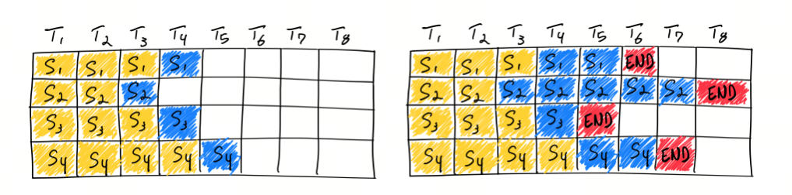

大模型的latency（延迟）和throughput（吞吐量）有什么区别？
## 1. 导入
为了快速应用大模型，我们需要采购商业大模型。采购前，对接销售时，我们描述了我们的场景和需求：

Q：我们的prompts token数量在1500-2000之间，completion token数量在500左右。这种情况下，prefilling多久？每个token输出是多久？

销售回复：标准3500 token Input，首包吐出来小于1秒；throughput 300token/s.

你是否看出来答非所问了？

问的和latency相关，回答的是throughput。那这两个词有什么区别？导致连这个领域的销售都会搞混？


在搞懂latency和throughput之前，我们先来看看KV cache 和 prefilling。

## 2. KV Cache
KV Cache 采用以空间换时间的思想，复用上次推理的 KV 缓存，可以极大降低内存压力、提高推理性能，而且不会影响任何计算精度。

decoder架构里面最主要的就是 transformer 中的 self-attention 结构的堆叠，KV-cache的实质是用之前计算过的 key-value 以及当前的 query 来生成下一个 token。

prefill指的是生成第一个token的时候，kv是没有任何缓存的，需要预填充prompt对应的KV矩阵做缓存，所以第一个token生成的最慢，而从第二个token开始，都会快速获取缓存，并将前一个token的kv也缓存。

可以看到，这是一个空间换时间的方案，缓存会不断变大，所以在私有化部署计算显存的时候，除了模型大小，还要要看你的应用中prompt和completion的大小（当然还有batch-size）。


## 3. Prefilling & Decoding

如果你使用商用大模型，或者使用开源大模型本地化部署，除了生成的质量之外，另外一个关键的指标就是生成token的速度。而且并不是简单的每秒生成多少个token，而是拆成了两个阶段：
- prefill：预填充，并行处理输入的 tokens；
- decoding：解码，逐个生成下一个 token.

### 预填充（prefill）
在预填充阶段，模型会并行处理输入的 prompt（即 input token），生成 KV cache。这一步骤包括一次完整的前向传播（forward），并输出第一个 token。这个过程的时间主要由 input token 决定，因为它们需要进行一次全面的计算来初始化整个生成过程。

### 解码（decoding）
解码阶段是逐个生成下一个 token 的过程。在这一步中，output token 的数量决定了需要进行多少次前向传播。虽然每次前向传播由于 KV cache 的存在而更快，但这仍然需要模型多次计算，逐步生成每一个后续的 token。

### 不同的公司使用的术语不同：
- 首token延迟，Time To First Token (TTFT), prefill, Prefilling

   指的都是从输入到输出第一个token 的延迟；

- 每个输出 token 的延迟（不含首个Token）,Time Per Output Token (TPOT)

  指的是第二个token开始的吐出速度；

- 延迟Lantency
  
  理论上即从输入到输出最后一个 token 的时间，原则上的计算公式是：Latency = (TTFT) + (TPOT) * (the number of tokens to be generated)；

- Tokens Per Second (TPS)：

  (the number of tokens to be generated) / Latency；

## 4. Latency VS Throughput
- Latency：延迟，指的是从输入到输出的时间，即从输入到输出最后一个 token 的时间；


- Throughput：吞吐量，指的是单位时间内处理的任务数，即每秒处理的 token 数。


下面给出latency和throughput的计算方法：

```python
# constants
max_tokens = 10

# observations
durations = []
throughputs = []
latencies = []

batch_sizes = [2**p for p in range(8)]
for batch_size in batch_sizes:
    print(f"bs= {batch_size}")

    # generate tokens for batch and record duration
    t0 = time.time()
    batch_prompts = [
        prompts[i % len(prompts)] for i in range(batch_size)
    ]
    inputs = tokenizer(
        batch_prompts, padding=True, return_tensors="pt"
    )
    generated_tokens = generate_batch(inputs, max_tokens=max_tokens)
    duration_s = time.time() - t0

    ntokens = batch_size * max_tokens
    throughput = ntokens / duration_s
    avg_latency = duration_s / max_tokens
    print("duration", duration_s)
    print("throughput", throughput)
    print("avg latency", avg_latency)    
    print()

    durations.append(duration_s)
    throughputs.append(throughput)
    latencies.append(avg_latency)
```

## 5. Navie batching

Navie batching是指将多个输入合并成一个batch，然后一次性输入模型，这样可以减少模型的前向传播次数，提高效率。
有的人也称其为synchronous batching或者static batching，区别于后面的continuous batching。



Navie batching的缺点是，如果一个batch中有一个输入很大，那么整个batch的计算时间就会被拉长，这样会导致整个batch的计算时间变长。

## 6. Continuous batching

在传统的批处理方法中，一批请求必须全部完成处理后才能一起返回结果。这就意味着较短请求需要等待较长请求处理完成，导致了GPU资源的浪费和推理延迟的增加。而Continuous Batching技术允许模型在处理完当前迭代后，如果有请求已经处理完成，则可以立即返回该请求的结果，而不需要等待整个批次的请求都处理完成，这样可以显著提高硬件资源的利用率并减少空闲时间。


此外，Continuous Batching还能够解决不同请求计算量不同导致的资源浪费问题，通过迭代级别的调度动态调整批处理大小，适应不同请求的复杂程度，有效降低高复杂度请求的等待时间。

值得注意的是，实现Continuous Batching需要考虑一些关键问题，如对Early-finished Requests、Late-joining Requests的处理，以及如何处理不同长度的请求Batching。OCRA提出的两个设计思路：Iteration-level Batching和Selective Batching，就是为了解决这些问题。

在实际应用中，不同的框架可能对Continuous Batching有不同的实现方式。例如，vLLM框架采用了一种简化的实现，将prefill和decoding分开处理，而FastGen框架则采用了SplitFuse方法，将长prompt分解成小块并在多个step中调度。这些不同的实现方式都旨在提高推理性能，降低延迟，同时优化资源的利用


给出生成continous batching的代码：

```python
# seed the random number generator so our results are deterministic
random.seed(42)

# constants
queue_size = 32
batch_size = 8

# requests waiting to be processed
# this time requests are tuples (prompt, max_tokens)
request_queue = [
    (prompts[0], 100 if i % batch_size == 0 else 10)
    for i in range(queue_size)
]

t0 = time.time()
with tqdm(total=len(request_queue), desc=f"bs={batch_size}") as pbar:
    # first, let's seed the initial cached_batch
    # with the first `batch_size` inputs
    # and run the initial prefill step
    batch = init_batch(request_queue[:batch_size])
    cached_batch = generate_next_token(batch)
    request_queue = request_queue[batch_size:]

    # continue until both the request queue is 
    # fully drained and every input
    # within the cached_batch has completed generation
    while (
        len(request_queue) > 0 or
        cached_batch["input_ids"].size(0) > 0
    ):
        batch_capacity = (
            batch_size - cached_batch["input_ids"].size(0)
        )
        if batch_capacity > 0 and len(request_queue) > 0:
            # prefill
            new_batch = init_batch(request_queue[:batch_capacity])
            new_batch = generate_next_token(new_batch)
            request_queue = request_queue[batch_capacity:]

            # merge
            cached_batch = merge_batches(cached_batch, new_batch)

        # decode
        cached_batch = generate_next_token(cached_batch)

        # remove any inputs that have finished generation
        cached_batch, removed_indices = filter_batch(cached_batch)
        pbar.update(len(removed_indices))

duration_s = time.time() - t0
print("duration", duration_s)
```

## 参考

[1] [deeplearning.ai](https://learn.deeplearning.ai/courses/efficiently-serving-llms/lesson/3/batching)

[2] [Continuous Batching：一种提升 LLM 部署吞吐量的利器](https://www.high-flyer.cn/en/blog/continuous-batching/)

[3] [LLM 推理优化 Continuous Batching 及其实现](https://yangwenbo.com/articles/llm-continuous-batching.html)

[4] [How continuous batching enables 23x throughput in LLM inference while reducing p50 latency](https://www.anyscale.com/blog/continuous-batching-llm-inference)

[5] [GitHub: LLMForEverybody](https://github.com/luhengshiwo/LLMForEverybody)


